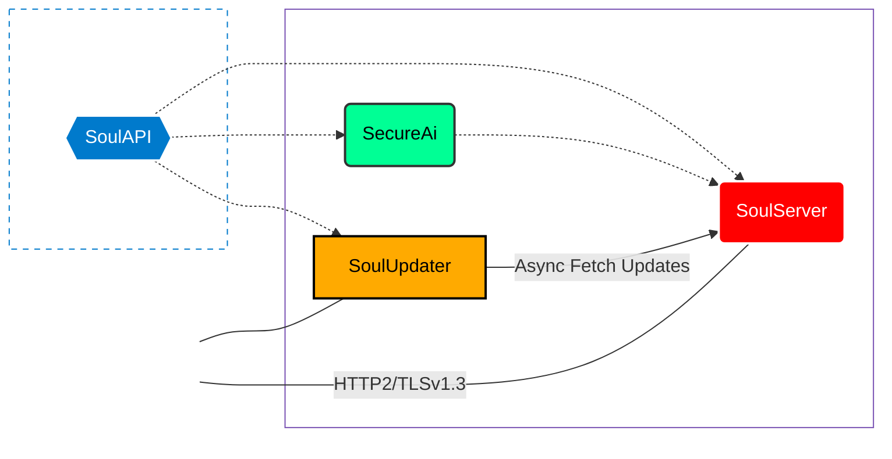

# 
🗝️ Secure Your Soul

  <i>Advanced ecosystem for digital sovereignty and cryptographic privacy.</i>

  
  
  
  
  
   

    
    
    
    
  

---

### 🧬 System Architecture
Wizualizacja przepływu danych i interakcji między komponentami TypeScript:

---

### 🌐 Open Source Core
*Publiczne fundamenty oparte na ścisłym typowaniu (Strict TS).*

| Repository | Purpose | Tech Stack | Status |
| :--- | :--- | :--- | :--- |
| **[SoulAPI](https://github.com/Secure-Your-Soul/SoulAPI)** | Centralna logika, zarządzanie sesjami i walidacja typów. | `TypeScript` `ESM` |  |
| **[SoulUpdater](https://github.com/Secure-Your-Soul/SoulUpdater)** | Automatyzacja synchronizacji i deploymentu modułów TS. | `TypeScript` `ESM` |  |

---

### 🔒 Enterprise Tier
*Prywatna infrastruktura i algorytmy AI.*

> [!CAUTION]
> **SecureAi** oraz **SoulServer** są repozytoriami o ograniczonym dostępie. Wykorzystują autorskie mechanizmy szyfrowania binarnego oraz dedykowane modele AI.

* **SoulServer**: Engine w TypeScript obsługujący strumieniowanie binarne, multiplexing HTTP/2 oraz system i18n.
* **SecureAi**: Zaawansowany moduł AI do bezpiecznego przetwarzania danych w architekturze *privacy-first*.

---

### 🛠️ Core Technology Matrix
* **Runtime:** Node.js 22+ (ESM)
* **Language:** TypeScript (Strict Mode / NoImplicitAny)
* **Communication:** HTTP/2 Push & Binary Streaming
### 🛡️ Cryptographic Standards
| Feature | Algorithm | Note |
| :--- | :--- | :--- |
| **Key Exchange (KEM)** | `ML-KEM-768` (Kyber) | Hybrid X25519 for Quantum Resistance |
| **Cipher Suite** | `AES-256-GCM` | Symmetric encryption for data streams |
| **Signatures** | `ML-DSA` (Dilithium) | Post-Quantum digital signatures |
| **TLS Protocol** | `v1.3` | Forced strict mode (No legacy fallback) |

---

### ⚡ Activity & Ecosystem Metrics

  
  
  

### 💻 Most Used Languages

  

---

  
  

---

  
  <b>Secure Your Soul</b> • 2025  
  <i>"Encrypting the digital self."</i>

